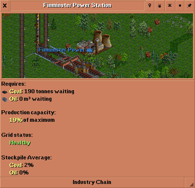

# dSPI

dSPI is a vanilla industry stockpiling NewGRF for OpenTTD.

Industries are altered so that cargo is produced periodically by drawing on
their input stockpile. If you fill up the stockpile, the industry will refuse
delivery and you won't get paid!

However, industries with a healthy stockpile and good level of transported cargo
will ramp up production allowing you to deliver more!

## Features
  * Stockpiling secondary and tertiary industries
  * Smooth economy style production changes
  * Power station consumption tied to industry demand
  * Dual-fired power stations, coal and oil
  * Secondary industry power requirements (enabled via parameter)
  * Iron ore and coal required to produce steel

With hopefully more [to come](TODO.md)! Temperate landscape only, for now at
least.

## Screenshots

## Parameters
**Secondary industries require power**  
If enabled secondary industries require power to produce cargo.

## Recommended Settings
The following settings are recommended when using dSPI:
  * Economy type: Smooth
  * No. of towns: Very Low

This aligns primary industry production changes with other industries and allows
power stations to cover as wide an area as possible.

## Acknowledgements
Shout out to Borg's [BSPI](https://www.tt-forums.net/viewtopic.php?t=84735) for
inspiring this!
